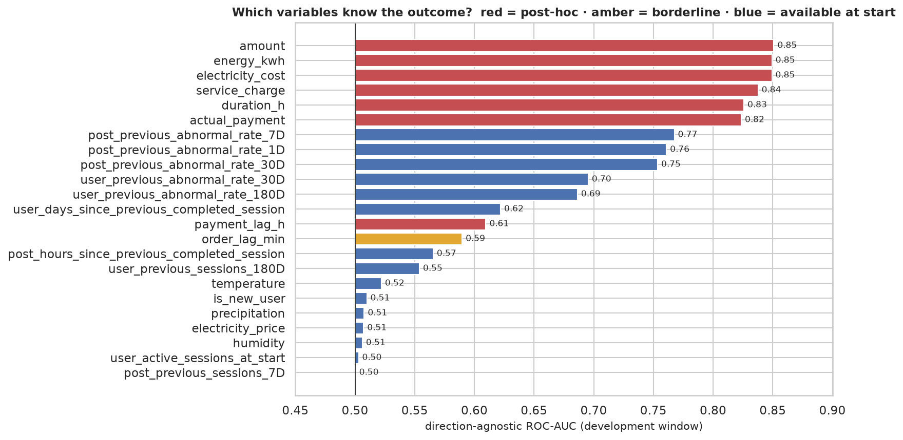
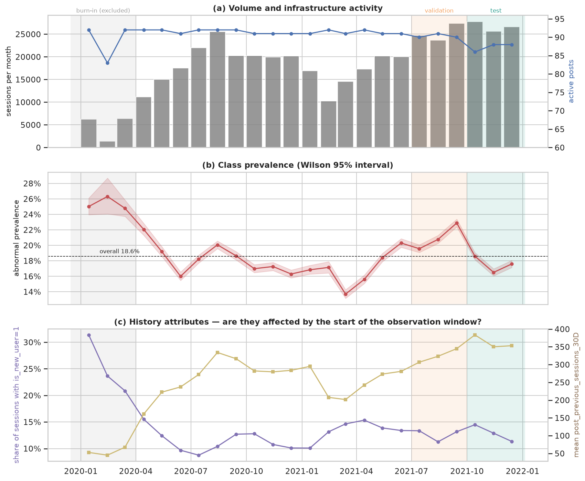
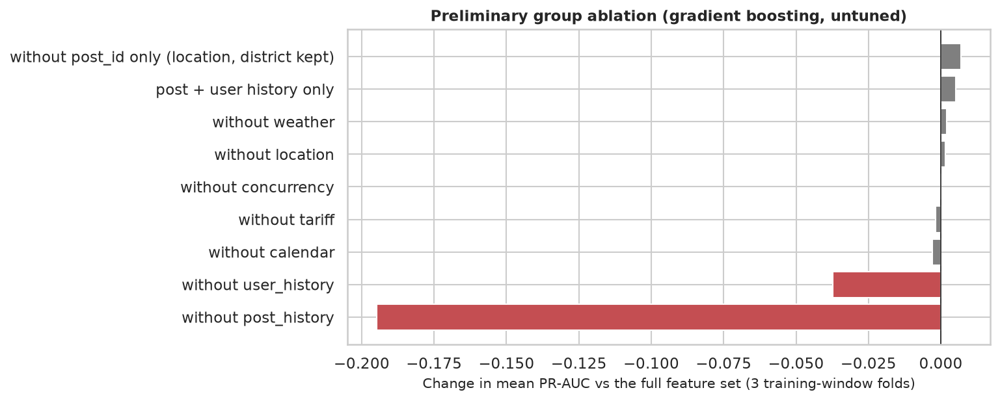

# Project 1, Task 1: Data understanding, audit and preparation

*MINDD 2026/27 · MEI · ISEP · Group report section.* The formatted version is `docs/TASK1_REPORT.pdf`, built from
`docs/report/main.tex`. Keep both texts identical.

## 1. Introduction

The goal is to predict, at the moment an EV charging session starts, whether it will end abnormally. Every
preparation decision answers two questions: would this information exist at that moment, and is it trustworthy? The
data are an educational adaptation of the China EV Charging Dataset (Zhang et al., 2025): 441,077 sessions and 47
columns, from 31 Dec 2019 to 31 Dec 2021, at 92 charging posts in 13 stations and 3 districts of Jiaxing. The numbers
come from the notebook [`TP1_Task1_Merged.ipynb`](../TP1_Task1_Merged.ipynb) (seed 42), and references of the form §x.y
point to its sections. References of the form C-§x.y point to the extended notebook
[`TP1_Task1_Data_Understanding_and_Preparation.ipynb`](../TP1_Task1_Data_Understanding_and_Preparation.ipynb), which
holds the model-based diagnostics (feature-group ablation, class weights, cold-start scores) that move to Task 2.

### 1.1 Target definition

The file has no `is_Abnormal` column, so we derive it from `end_cause` (15 categories). The dataset's pre-computed
abnormal-count history columns were built from the true label, so we recomputed them under three candidate mappings
(Table 1.1, §5.2 for mappings A and B, C-§4.2 for all three). Only mapping A reproduces them. We adopt it, pending the instructor's confirmation. The classes are
about 4.4 : 1, so an "always normal" model reaches 81% accuracy, and accuracy is not an adequate metric.

| Definition of "abnormal" | Rows matching the supplied counts (6 windows) | Prevalence |
| --- | --- | --- |
| A. 13 fault causes ("Charging ends normally" and "User stops charging" are normal) | ≥ 99.97% in every window | 18.58% |
| B. Everything except "Charging ends normally" | 0.3–36% | 53.93% |
| C. Charger faults only (vehicle-side faults count as normal) | 2–70% | 12.11% |

## 2. Data audit and exploration

### 2.1 Availability at prediction time

Seven post-hoc variables (energy, electricity cost, service charge, amount, actual payment, end time, payment time)
and `end_cause` describe the result of the session, so we exclude them. On their own they reach univariate ROC-AUC
0.82–0.85, above any legitimate variable (best 0.77, Figure 2.1). Adding them to the model raises PR-AUC from 0.604 to
0.834 (C-§15.3), which is the optimistic, non-deployable result a leaky preparation would report. We also exclude
`Order creation time`: it is stamped after the start in 56% of sessions and adds nothing measurable (−0.003 PR-AUC).

### 2.2 History attributes

**Meaning.** Recomputing the history attributes from the timestamps reproduces the session counts in at least 99.96%
of rows and the concurrency count in 99.97% (C-§4.3). Only sessions that ended before the current start are counted, so
there is no look-ahead.

**Operational availability.** Post history needs a store that updates per-post counts when each session ends, and the
platform already records end causes. User history also needs the account to be identified at start. Our validation
and test values assume that this store is updated continuously.

**Privacy.** User history is a behavioural profile tied to a pseudonymous identifier. Removing it costs 0.037 PR-AUC,
against 0.195 for post history (C-§15.1), so the modelling task will compare models with and without it.

**Generalisation and cold start.** History replaces identities, so it works for accounts unseen in training (40% of
validation and 61% of test sessions). New accounts (about 13% of sessions) get the prior rate 0.2 and missing
time-since values, and the model ranks them worse (C-§15.2). Post cold start cannot be tested, because every validation
and test post appears in training.

### 2.3 Data quality

We removed no record and investigated each anomaly before deciding (Table 2.1; §4, §6, §10).

| Check | Finding | Decision |
| --- | --- | --- |
| Duplicates | None (full rows or user + post + start) | No action |
| Formatting | Trailing tab in 2 timestamp columns and 18,370 location values | Stripped on load |
| Missing values | Only in the 4 "time since previous" columns; NaN equals the "no previous" flag in 100% of rows | Structural, not imputed with mean or median; informative (14.4% vs 19.3% abnormal) |
| Zero energy | 54,621 sessions, 45,563 of them abnormal | Kept: early faults and cancellations deliver no energy |
| Post-hoc timestamps | Durations stop at 23.99 h; 87,202 payments recorded before the end | Not used; censoring noted as a limitation |
| Weather | One value per district and day | Treated as a forecast, as instructed (limitation) |
| Outliers | Idle posts (39% abnormal on return), fleet accounts, rainstorm days; Isolation Forest flags informative sessions | All kept; log and capping in the linear view only |
| Cardinality | 92 posts, the smallest with 244 training sessions; fault causes from 20,114 down to 5 sessions | No grouping needed for a binary target |

### 2.4 What relates to abnormal termination

We measure relationships on the development window only (Apr 2020 to Jun 2021). The post matters most among static
variables: abnormal rates range from 4% to 61% across posts (Cramér's V 0.30, against 0.23 for station and 0.11 for
district), and post-level rates correlate at Spearman ρ = 0.81 between 2020 and 2021. Calendar and weather effects are
small (V ≤ 0.042). Recent failure history is the strongest signal: the seven post-history variables top the univariate
ranking (AUC 0.71–0.77) because faults cluster in time at the same post (§9.4). The supplied rates are smoothed as
(abnormal + 1) / (sessions + 5), so an entity without history gets 0.2. Sessions concentrate in a few accounts (the
top 1% hold 34%), so `user_id` is not usable and user history replaces it.

### 2.5 Temporal stability

The process is not stationary (Figure 2.2). Monthly volume falls to 1,391 sessions in Feb 2020, coinciding with the
COVID-19 restrictions, and reaches 25–28k in autumn 2021. Prevalence ranges from 13.7% to 26.3% per month, and
faulty-connection faults fall from 28% of abnormal sessions in 2020Q1 to about 6% from 2020Q3. 90–92 posts are active
each month until posts 17–20 stop on 28 Sep 2021, and active accounts grow from about 2,000 to 5,600–7,500 per month.
The history attributes are censored at the start of the file: 31% of Jan 2020 sessions are flagged as new users (about
13% later), and their PSI is far above 0.25 in Q1-2020 and at most 0.10 from Q3-2020. A random split would mix these
regimes and overstate performance, so evaluation is chronological.

## 3. Preparation and evaluation

### 3.1 Evaluation design

| Period | Dates | Sessions | Abnormal |
| --- | --- | --- | --- |
| Burn-in (excluded) | 31 Dec 2019 to 31 Mar 2020 | 14,017 | 25.0% |
| Train | 1 Apr 2020 to 30 Jun 2021 | 271,182 | 17.8% |
| Purged | Train starts that end after 1 Jul 2021 | 28 | n/a |
| Validation | Jul to Sep 2021 | 75,769 | 21.1% |
| Test (used once) | Oct to Dec 2021 | 80,081 | 17.6% |

Table 3.1 shows the split. The burn-in is excluded because its history values are censored and its fault regime is
obsolete; including it changes PR-AUC by only +0.0009 (C-§15.4). Training rows must also *end* before the cutoff, since
their label is unknown until then (purge). Hyper-parameters will be tuned with three expanding-window folds inside the
training period. We will report PR-AUC with lift over the base rate, ROC-AUC, the Brier score, and precision and
recall at a threshold chosen on validation.

### 3.2 Retained features and learned operations

We retain 29 features in 7 groups: calendar (hour, day of week), tariff period, location (`post_id`, station,
district), weather (4), post history (8), user history (10) and concurrency (1). We drop `electricity_price` (a
function of the tariff), the six abnormal-count columns (exact functions of counts and rates; adding them back changes
nothing, C-§15.4), the post "no history" flags (constant after the burn-in), `user_no_previous_completed_session`
(φ ≈ 1 with `is_new_user`), `is_weekend` (V = 0.001) and `user_id`.

Every operation that learns from data is fitted on the training period only, inside scikit-learn pipelines (Table
3.2, C-§13). Fitting on all periods would change the parameters; for example, the structural-NaN fill would move from
394 to 511 days. `log1p` and the sine/cosine encoding of hour and weekday are stateless.

| Operation | What is learned | Used by |
| --- | --- | --- |
| Category codes / one-hot (`post_id`, station, district, tariff) | Category list | Tree / linear view |
| Winsorisation of heavy-tailed variables | 0.1th and 99.9th percentiles | Linear view |
| Structural-NaN fill ("never happened") | Maximum; indicators kept | Linear view (trees keep NaN) |
| Standardisation | Mean and standard deviation | Linear view |
| Reduced numeric set (19 variables, max VIF 65 to 8.6) | Correlations on a training sample | Unregularised linear models |
| Class-imbalance treatment | Class weights or resampling | Training folds only |
| Rare-category grouping, PCA | Nothing | Not needed / not adopted |

### 3.3 Preliminary diagnostics

A fixed, untuned gradient-boosting model on the training-window folds reaches PR-AUC 0.604 (folds 0.569–0.640; lift
3.56) and ROC-AUC 0.832. These runs check preparation decisions; they are not model selection. Removing post history
drops PR-AUC to 0.409, removing user history costs 0.037, and the other groups, `post_id` included, change it by at
most 0.007 (Figure 3.1). Class weights leave the ranking unchanged (0.602 vs 0.604) but push the mean prediction to
0.34 against a prevalence of 0.17, so the prepared data are not resampled and SMOTE is not used. For new accounts,
ROC-AUC is 0.714 (lift 2.38), against 0.845 (lift 3.80) for returning users.

## 4. Synthesis

1. **Main characteristics and problems.** The target had to be derived and validated (18.6% abnormal). Eight outcome
   columns and one doubtful timestamp would leak it. Missing values are structural and no record is invalid. Volume,
   prevalence, fault mix and site mix drift, and history is censored in Q1-2020. Risk concentrates by post, and recent
   post failure history is the strongest signal.
2. **Evidence for the decisions.** The history-count oracle (target), AUC and PR-AUC inflation (leakage), the 100%
   match between NaN and its flag (missing values), the outlier investigation, PSI and monthly analyses (split), exact
   identities confirmed in C-§15.4 (redundancy), and the ledger of training-only parameters.
3. **Retained variables.** 29 features in 7 groups. Post history is essential and user history is useful; the context
   groups remain candidates for the modelling task.
4. **Limitations and assumptions.** The target mapping is inferred; weather is assumed to be a forecast but is daily;
   durations are censored at 24 h; payment and order timing semantics are unknown; the causes of drift are hypotheses;
   post cold start cannot be tested; history in validation and test assumes a continuously updated store; fleet
   accounts dominate user counts; the diagnostics use one untuned model.
5. **Implications for modelling.** Chronological split with purge, expanding-window cross-validation and a single use
   of the test set; PR-AUC with lift, ROC-AUC and calibration instead of accuracy; imbalance handled by the threshold or
   in-fold weights; tree ensembles and a regularised logistic-regression baseline; models compared with and without
   `post_id` and user history, with cold-start users reported separately.

## Reference

Zhang, Y., Xu, T., Chen, T., et al. (2025). A high-resolution electric vehicle charging transaction dataset with
multidimensional features in China. *Scientific Data*, 12, 643. https://doi.org/10.1038/s41597-025-04982-1
