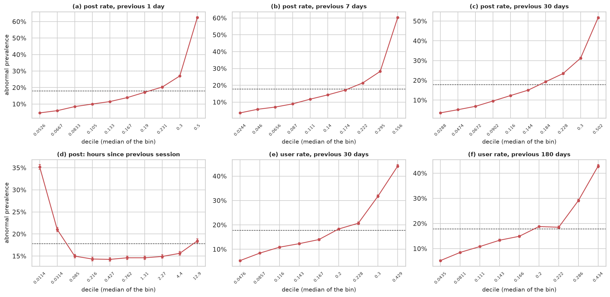
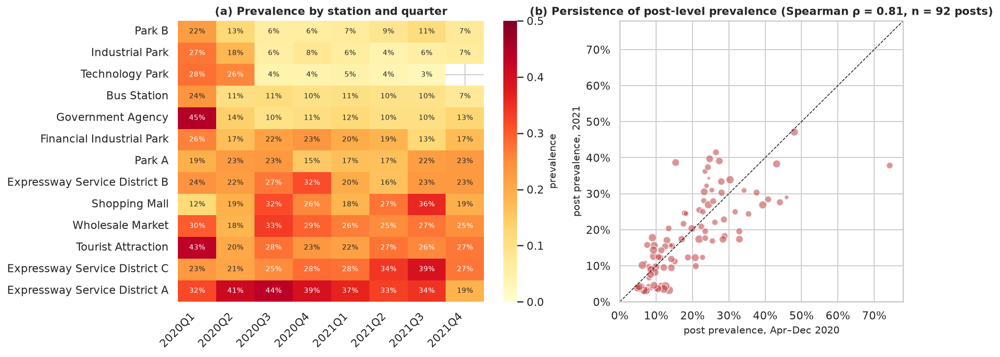

# Project 1, Task 1: Data understanding, audit and preparation

*MINDD 2026/27 · MEI · ISEP · Group report section.* All numbers and figures come from
[`TP1_Task1_Data_Understanding_and_Preparation.ipynb`](../TP1_Task1_Data_Understanding_and_Preparation.ipynb)
(seed 42). Section numbers (§) refer to that notebook.

## 1. Objective and data

The goal is to predict whether an EV charging session will end abnormally at the moment it starts. Every preparation
decision answers two questions. Would this information exist at that moment, and is it trustworthy?

The data are an educational adaptation of the China EV Charging Dataset (Zhang et al., 2025). They hold 441,077 sessions and
47 columns, from 31 Dec 2019 to 31 Dec 2021, at 92 charging posts in 13 stations and 3 districts of Jiaxing.

## 2. Target definition

The file has no `is_Abnormal` column, so we derive it from `end_cause` (15 categories). We tested candidate mappings
against the dataset's own pre-computed abnormal-count history columns, which were built from the true label (§4.2).

| Candidate definition of "abnormal" | Rows where the recomputed count matches (6 windows) | Prevalence |
| --- | --- | --- |
| A. 13 fault causes (normal = "Charging ends normally" and "User stops charging") | ≥ 99.97% in every window | 18.58% |
| B. Everything except "Charging ends normally" | 0.3–36% | 53.93% |
| C. Charger faults only (vehicle-side BMS, communication and charging faults count as normal) | 2–70% | 12.11% |

We adopt mapping A. It is an inference, and the instructor must confirm it. The ratio is about 4.4 : 1, so
an "always normal" model reaches 81% accuracy. Accuracy is therefore not an adequate metric.

## 3. Availability at prediction time (leakage)

Seven post-hoc variables (energy, electricity cost, service charge, amount, actual payment, end time, payment time) and
`end_cause` describe the result of the session, so we exclude them. Figure 1 shows why. On their own they reach univariate
ROC-AUC 0.82–0.85, above any legitimate variable (best 0.77). In the §15.3 diagnostic, adding them to the model raises PR-AUC
from 0.604 to 0.834. That is the size of the optimistic, non-deployable result a leaky preparation would report.

We also exclude `Order creation time`. It is stamped after the start in 56% of sessions, so its availability is doubtful,
and it adds nothing measurable (−0.003 PR-AUC, §15.3).

### History attributes: availability, privacy and cold start

**Meaning.** We did not take the supplied history attributes on trust. Recomputing them from the start and end timestamps
reproduces the session counts in at least 99.96% of rows, the time since the previous session in 99.97% (user) and 99.999%
(post), and `user_active_sessions_at_start` in 99.97% (§4.3). Only sessions that ended before the current start are counted,
so the attributes contain no look-ahead. `is_new_user` means "first session of the account in the file" in 100% of rows.

**Operational availability.** Post history needs a store that records each session's end cause when the session ends and
updates per-post counts. The platform already records end causes, so this is realistic. User history also needs the account
to be identified when the session starts, before any energy flows. Concurrency needs the live status of the account's other
sessions. In our validation and test periods, history values include outcomes of earlier sessions from those same periods.
This assumes the store is updated continuously in production.

**Privacy.** User history is a behavioural profile (how often an account charges and how often its sessions fail) linked to
a persistent pseudonymous identifier. Data minimisation says to keep it only if it adds value beyond post-level information.
In the preliminary ablation (§15.1), removing user history costs 0.037 PR-AUC, against 0.195 for post history. The modelling
task will therefore compare models with and without user history. A post-history model is the privacy-preserving
alternative. `user_id` itself is never a feature.

**Generalisation and cold start.** History attributes replace identities, so they also work for accounts never seen in
training (40% of validation and 61% of test sessions). New accounts (about 13% of sessions) have no user history: their
rates equal the prior 0.2 and their time-since values are missing, and the model ranks them worse (§15.2). Post cold start
cannot be tested, because every validation and test post appears in training. A new post would also start at the prior,
with station and district as the only post-level information.

## 4. Data-quality audit

We removed no record. We investigated each anomaly first (§3, §8, §9).

| Check | Finding | Decision |
| --- | --- | --- |
| Duplicates | none (full rows or user + post + start) | no action |
| Formatting | trailing tab in two timestamp columns and in 18,370 `Location Information` values | stripped on load (stateless) |
| Missing values | only in the four "time since previous…" columns, and each `NaN` matches its "no previous" flag in 100% of rows | structural ("never happened"), so not imputed with the mean or median. The pattern is informative (users without a previous fault: 14.4% vs 19.3% abnormal) |
| Zero-energy sessions | 54,621, of which 45,563 abnormal; about 9k labelled normal | kept, because early faults and user cancellations deliver no energy and a filter on a post-hoc variable cannot be reproduced at start |
| Durations | never reach 24 h (max 23.99 h) | apparent right-censoring. Duration is post-hoc, so this is a limitation only |
| Payment timing | 87,202 payments recorded before the end | post-hoc; kept for audit, not used |
| Weather | one value per district and calendar day | treated as a forecast, as the statement instructs. If it is an observed daily aggregate, it contains post-start information (limitation) |
| Outliers | right-skewed counts and durations. The extremes are idle posts (39% abnormal on return), fleet accounts and rainstorm days. Isolation Forest flags informative sessions, not erroneous ones | all retained; log and capping only in the linear view (Section 8 of this report) |
| Cardinality and rare categories | 92 posts in 13 stations and 3 districts, each post in exactly one station. The smallest post has 244 training sessions. The 13 fault causes range from 20,114 sessions down to 5 | no grouping. The rare fault causes do not matter for a binary target, only for reading the fault mix (Section 6) |

## 5. What relates to abnormal termination

*We measure relationships on the development window only (Apr 2020 to Jun 2021), never on validation or test.*

- **The post matters most among static variables.** Abnormal rates range from 4% to 61% across posts. Cramér's V (an effect
  size for categorical association) is 0.30 for post, 0.23 for station and 0.11 for district.
- **Post risk persists.** Post-level rates correlate at Spearman ρ = 0.81 between 2020 and 2021.
- **Calendar effects are small** (V ≤ 0.042). The hourly rate ranges from 14.7% (07 h) to 20.5% (12 h). Weather effects are
  also weak.
- **Recent failure history is the strongest signal.** The pre-computed rates use additive smoothing:
  rate = (abnormal + 1) / (sessions + 5), a prior of 0.2 with weight 5. The seven post-history variables top the univariate
  ranking (AUC 0.71–0.77) because faults cluster in time at the same post (Figure 2).
- **Sessions are concentrated in a few accounts.** The median account has 2 sessions, the top 1% of accounts hold 34% of sessions, and two
  accounts look like fleets. A large share of validation and test sessions (40% and 61%) comes from accounts never seen in training, so `user_id`
  is not a usable predictor. User history replaces it.

## 6. Temporal stability

The process is not stationary (Figures 3 and 4).

- **Volume swings widely.** It falls to 1,391 sessions in Feb 2020, which coincides with the COVID-19 restrictions, and dips
  again in Feb 2021 around the Spring Festival. It reaches 25–28k sessions per month in autumn 2021. Both explanations come
  from outside the data.
- **Prevalence moves.** It ranges between 13.7% and 26.3% per month.
- **The fault mix changes.** Faulty-connection faults fall from 28% of abnormal sessions in 2020Q1 to about 6% from 2020Q3.
- **The site mix changes.** 90–92 posts are active each month until posts 17–20 (all of Technology Park) stop on
  28 Sep 2021, leaving 86–88 in the test quarter. Station-level rates drift.
- **User activity grows.** Active accounts per month rise from about 2,000 in Jan and Mar 2020 to 5,600–7,500 in the second half of 2021.
- **History attributes are censored at the start of the file.** In Jan 2020, 31% of sessions are flagged as new users
  (about 13% later). The PSI of the history features is far above 0.25 in Q1-2020 and at most 0.10 from Q3-2020. PSI (Population
  Stability Index) measures how much a distribution shifts, and a value above 0.25 usually signals a large shift.

A random split would therefore mix regimes and overstate performance. Evaluation must be chronological.

## 7. Evaluation design

| Period | Dates | Sessions | Abnormal |
| --- | --- | --- | --- |
| Burn-in (excluded) | 31 Dec 2019 to 31 Mar 2020 | 14,017 (3.2%) | 25.0% |
| Train | 1 Apr 2020 to 30 Jun 2021 | 271,182 | 17.8% |
| Purged | train starts that end after 1 Jul 2021 | 28 | n/a |
| Validation | Jul to Sep 2021 | 75,769 | 21.1% |
| Test (used once) | Oct to Dec 2021 | 80,081 | 17.6% |

- **Burn-in.** We exclude it because its history values are censored and its fault regime is obsolete. Including it changes
  PR-AUC by +0.0009 (§15.4), so the exclusion is harmless.
- **Purge.** Training rows must also *end* before the cutoff, because their label is unknown until then.
- **Tuning.** We tune hyper-parameters with three expanding-window folds inside the training period.
- **Metrics.** We will report PR-AUC with lift over the base rate, ROC-AUC, the Brier score for calibration, and precision and recall of the abnormal
  class at a threshold chosen on validation.

## 8. Retained features and preparation

We retain 29 features in 7 groups:

| Group | Features |
| --- | --- |
| Calendar | hour, day of week |
| Tariff | tariff period |
| Location | `post_id`, station, district |
| Weather | temperature, humidity, precipitation, rain flag |
| Post history | 8 attributes |
| User history | 10 attributes |
| Concurrency | `user_active_sessions_at_start` |

Besides the leakage variables, we drop:
- `electricity_price`: a function of the tariff.
- The six abnormal-count columns: exact functions of the session counts and rates. Adding them back changes nothing (§15.4).
- The post "no history" flags: constant after the burn-in.
- `user_no_previous_completed_session`: equivalent to `is_new_user` (φ ≈ 1).
- `is_weekend`: V = 0.001.
- `user_id`.

The operations that learn from data are all fitted on the training period only, inside scikit-learn pipelines (§13):

| Learned operation | What is learned | View |
| --- | --- | --- |
| Category codes (`post_id`, station, district, tariff) / one-hot (`post_id`, tariff) | category list from training | tree / linear |
| Winsorisation of heavy-tailed variables | training 0.1th / 99.9th percentiles | linear |
| Structural-`NaN` fill ("never happened") | training maximum; indicators kept | linear (trees keep `NaN`) |
| Standardisation | training mean / standard deviation | linear |
| Reduced numeric set (19 variables, max VIF from 65 to 8.6) | correlations on a training sample | unregularised linear / distance models |
| Class-imbalance treatment | class weights or resampling | training folds only (modelling task) |
| Rare-category grouping, PCA | nothing | not needed / evaluated and not adopted |

`log1p` and the sine/cosine encoding of hour and weekday are stateless. Fitting the learned steps on all periods would change
their parameters (for example, the structural-`NaN` fill moves from 394 to 511 days, §13). That change is the information
leak that training-only fitting prevents.

## 9. Preliminary diagnostics (training-window folds only)

We used a fixed, untuned gradient-boosting model to check the preparation decisions. It reaches PR-AUC 0.604 (fold range
0.569–0.640; lift 3.56) and ROC-AUC 0.832. These are not model-selection results. Figure 5 shows the change in PR-AUC
when each feature group is removed.

- **Post history dominates.** Removing it drops PR-AUC to 0.409.
- **User history adds a smaller share.** Removing it changes PR-AUC by −0.037.
- **The other groups add nothing measurable once history is present** (|Δ| ≤ 0.007). This includes `post_id`, whose
  persistent signal the post's own failure rates already capture.
- **Class weights leave the ranking unchanged** (PR-AUC 0.602 vs 0.604) but distort probabilities (mean prediction 0.34 vs
  prevalence 0.17). We therefore apply no resampling in the prepared data and do not adopt SMOTE.
- **Cold-start users are harder.** For new accounts, ROC-AUC is 0.714 and lift 2.38, against 0.845 and 3.80 for returning users.

## 10. Synthesis

1. **Main characteristics and problems.**
   - The target is not supplied and had to be derived and validated (18.6% abnormal).
   - Eight outcome columns and one doubtful timestamp would leak the target.
   - Missing values are structural only, and there are no invalid records.
   - Volume, prevalence, fault mix and site mix all drift, and the history attributes are censored in Q1-2020.
   - Risk concentrates by post and persists, but the strongest signal is recent post failure history.
   - Users are concentrated in a few accounts, and most future accounts are new.
2. **Evidence for the decisions.**
   - History-count oracle for the target.
   - AUC and PR-AUC inflation for the leakage exclusions.
   - `NaN` matches the "no previous" flag in 100% of rows for the missing values.
   - Investigation of outliers (idle posts, fleet accounts, Isolation Forest).
   - PSI, monthly and quarterly analyses for the split. The burn-in check shows the exclusion is harmless.
   - Exact identities for the redundant variables, confirmed by §15.4.
   - Ledger of parameters fitted on training only.
3. **Retained variables.** 29 features in 7 groups. Post history is essential and user history is useful. We keep the context
   groups as candidates for the modelling task.
4. **Unresolved limitations and assumptions.**
   - The target mapping is inferred.
   - Weather is assumed to be a forecast but is daily.
   - Durations are censored at 24 h.
   - The semantics of payment and order timing are unknown.
   - External causes of the drift are hypotheses.
   - Post cold start cannot be tested (every test post appears in training).
   - History values in validation and test assume a store that is updated continuously in production.
   - Fleet accounts dominate user counts.
   - The diagnostics use one untuned model.
5. **Implications for modelling.**
   - Chronological split with purge; expanding-window cross-validation; test used once.
   - PR-AUC with lift, ROC-AUC and calibration rather than accuracy.
   - Imbalance handled through the threshold or in-fold weights.
   - Tree ensembles (tree view) and a regularised logistic-regression baseline (linear view).
   - Compare models with and without `post_id` and with and without user history (privacy), and report cold-start users
     separately.

## Reference

Zhang, Y., Xu, T., Chen, T., et al. (2025). A high-resolution electric vehicle charging transaction dataset with
multidimensional features in China. *Scientific Data*, 12, 643. https://doi.org/10.1038/s41597-025-04982-1
